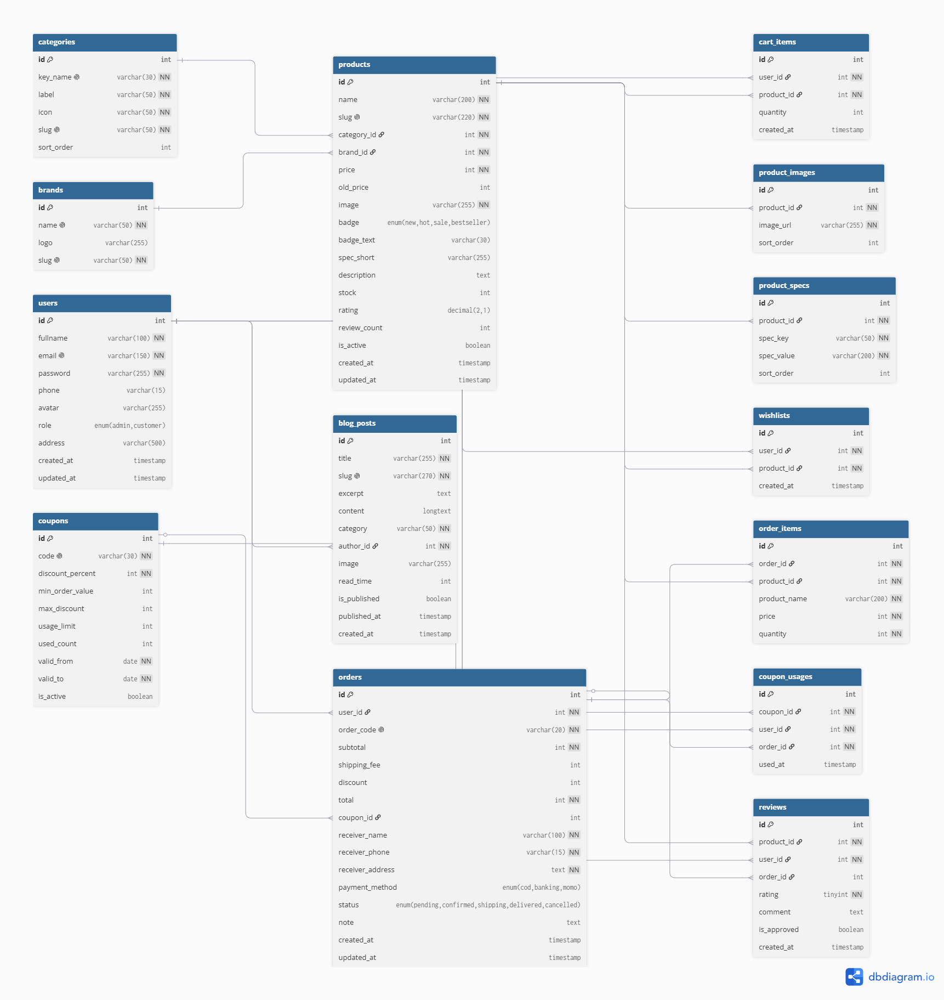
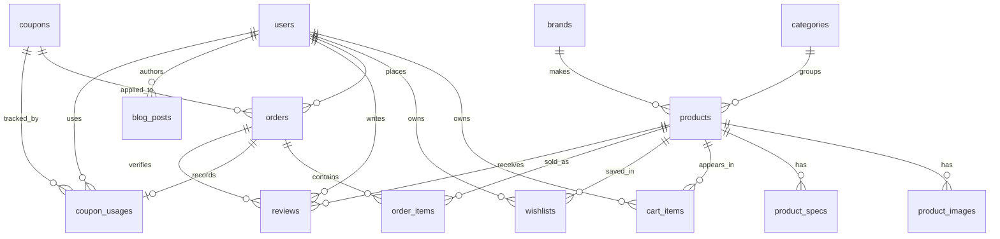

# Sơ đồ ERD - PC Gear Store

Thiết kế cơ sở dữ liệu cho backend PHP + MySQL.

## Sơ đồ ERD

Source DBML: [pcgear_store.dbml](pcgear_store.dbml) (import vào dbdiagram.io để xem/chỉnh sửa)

> Lưu ý: `erd.png` là ảnh export tĩnh. Sơ đồ Mermaid dưới đây phản ánh schema mới nhất trong tài liệu.

## Danh sách bảng

Tổng cộng 14 bảng:

| STT | Bảng | Mô tả |
|-----|------|-------|
| 1 | users | Người dùng (admin + khách hàng) |
| 2 | categories | Danh mục sản phẩm (12 loại) |
| 3 | brands | Thương hiệu (21 hãng) |
| 4 | products | Sản phẩm |
| 5 | product_images | Ảnh sản phẩm (nhiều ảnh / SP) |
| 6 | product_specs | Thông số kỹ thuật (key-value) |
| 7 | cart_items | Giỏ hàng |
| 8 | wishlists | Danh sách yêu thích |
| 9 | coupons | Mã giảm giá |
| 10 | orders | Đơn hàng |
| 11 | coupon_usages | Lịch sử sử dụng mã giảm giá theo user/order |
| 12 | order_items | Chi tiết đơn hàng |
| 13 | reviews | Đánh giá sản phẩm |
| 14 | blog_posts | Bài viết blog |

## Mô tả chi tiết

### users
Lưu thông tin người dùng. Cột `role` phân biệt admin và khách hàng. Password lưu dạng bcrypt hash.

### categories
12 danh mục sản phẩm: CPU, GPU, Mainboard, RAM, SSD, PSU, Case, Cooling, Monitor, Mouse, Keyboard, Headset.

### brands
21 thương hiệu: Intel, AMD, ASUS, MSI, Gigabyte, Corsair, G.Skill, Kingston, Samsung, Lexar, Logitech, Razer, HyperX, SteelSeries, Akko, DeepCool, Jonsbo, Xigmatek, LG, Kuycon, NVIDIA.

### products
Bảng chính chứa sản phẩm. Liên kết tới categories và brands qua FK. Cột `slug` dùng cho URL thân thiện SEO.

### product_images
Mỗi sản phẩm có thể có nhiều ảnh. Xóa sản phẩm thì ảnh tự xóa theo (ON DELETE CASCADE).

### product_specs
Thông số kỹ thuật dạng key-value (VD: Socket = LGA1700, TDP = 65W). Tách bảng riêng thay vì dùng JSON để dễ filter.

### cart_items
Giỏ hàng. UNIQUE(user_id, product_id) để tránh trùng — cùng 1 SP chỉ có 1 dòng, tăng quantity thôi.

### wishlists
Danh sách yêu thích. Tương tự cart_items, có UNIQUE(user_id, product_id).

### coupons
Mã giảm giá. Có giới hạn số lần dùng, ngày hết hạn, giá trị đơn tối thiểu.

### coupon_usages
Ghi nhận mã giảm giá đã được dùng ở đơn hàng nào, bởi user nào. Bảng này giúp kiểm soát giới hạn dùng mã và audit lịch sử khuyến mãi khi nối backend thật.

### orders
Đơn hàng. Trạng thái: pending → confirmed → shipping → delivered / cancelled.
Phương thức thanh toán: COD, chuyển khoản, MoMo.

### order_items
Chi tiết đơn hàng. Lưu snapshot tên SP và giá tại thời điểm mua (khi admin sửa giá sau thì đơn cũ không bị ảnh hưởng).

### reviews
Đánh giá sản phẩm. Liên kết order_id để xác minh người dùng đã mua hàng. Admin duyệt qua cột is_approved.

### blog_posts
Bài viết blog. Tác giả liên kết tới users (admin).

## Quan hệ giữa các bảng

| Bảng A | Bảng B | Quan hệ | Ghi chú |
|--------|--------|---------|---------|
| categories | products | 1:N | Mỗi danh mục có nhiều SP |
| brands | products | 1:N | Mỗi brand có nhiều SP |
| products | product_images | 1:N | CASCADE khi xóa SP |
| products | product_specs | 1:N | CASCADE khi xóa SP |
| users | cart_items | 1:N | Mỗi user 1 giỏ hàng |
| users | wishlists | 1:N | |
| users | orders | 1:N | |
| orders | order_items | 1:N | CASCADE khi xóa đơn |
| products | order_items | 1:N | |
| users | reviews | 1:N | |
| products | reviews | 1:N | |
| coupons | orders | 1:N | Nullable |
| coupons | coupon_usages | 1:N | Theo dõi lượt dùng mã |
| users | coupon_usages | 1:N | |
| orders | coupon_usages | 1:1 | UNIQUE(coupon_id, order_id) |
| users | blog_posts | 1:N | Admin viết bài |

## File liên quan

- `pcgear_store.dbml` — source code DBML, import vào [dbdiagram.io](https://dbdiagram.io) để xem sơ đồ trực quan
- `database.sql` — SQL script tạo database + seed data, import vào MySQL Workbench hoặc phpMyAdmin
